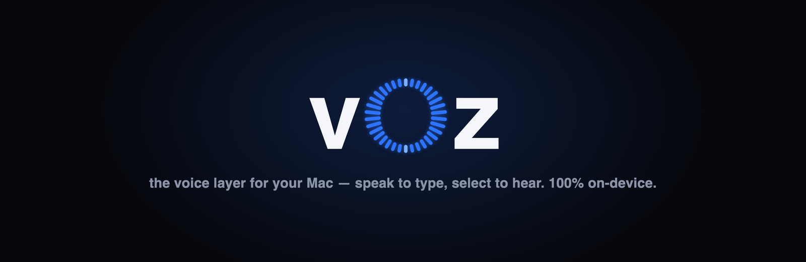
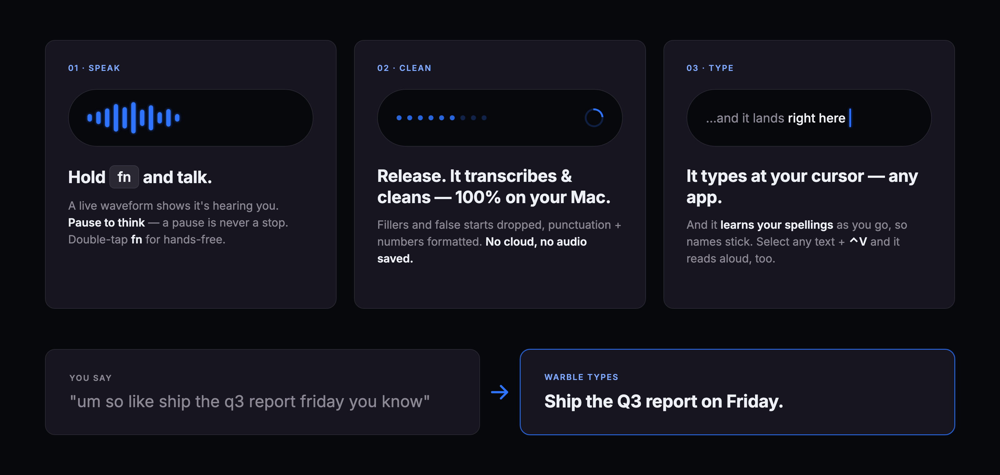
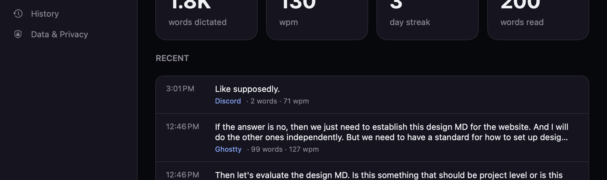

<div align="center">



[](LICENSE)
[](#download)
[](#privacy)

</div>

**warble** (*to sing with trills, the way a songbird does* — formerly **voz**) is the voice layer
for your Mac — a tiny menu-bar app, two halves of
one idea: **speak to type, select to hear.** It runs **100% on your Mac**: no cloud, no accounts, no
API keys, and **everything stays on your Mac** (your history + recordings are local-only, and you control them).

- 🎙 **Dictate** — hold **Fn** (or **double-tap Fn** for hands-free), speak, release. warble
  transcribes on-device, cleans it up — drops fillers ("um", "uh") and false starts, adds punctuation, formats
  numbers and dates — and types it where your cursor is, in any app.
- 🔊 **Read aloud** — select text anywhere and press **⌃V**. warble reads it in a warm neural voice,
  following along word by word.

## Download

### [⬇︎ Download warble for macOS](https://github.com/SethMed7/warble/releases/latest)

A **notarized `.dmg`** — open it, drag **warble** into Applications, launch. **macOS 13+.** No account,
no API key. It works **immediately** on Apple's built-in on-device engines; you only grant Microphone /
Accessibility the first time you use each mode.

Want the *premium* on-device engines (sharper dictation, warmer voices, LLM polish)? Open
**menu → "Set up better engines…"** — a transparent setup that checks your Mac, **states each
engine's download size and disk footprint before you consent**, and asks before installing
anything. Downloads run in the background (keep dictating on your current engine) and **resume
where they stopped** if interrupted. Nothing is required; nothing happens without your yes.

## See it work

<div align="center">

</div>

You talk the way you actually talk — fillers, self-corrections, even *"that's D H A V A L"* to spell
a name — and warble hands you clean, formatted text where your cursor is. It **learns the words you
correct** (and the ones you spell out), so names and jargon stick. Transcription runs from a warm
on-device engine, so it lands in well under a second — and nothing ever leaves your Mac.

## Highlights

- **100% on-device** — no cloud, no API keys, no accounts; your dictations and recordings are kept **local-only** in `~/.warble` (turn either off, or clear/export, in Dashboard ▸ Data & Privacy), never uploaded. The optional **Insights AI** layer is on-device too and **off by default** — it reads only your local **stats** (never your transcripts) to phrase a weekly recap, and is cached in `~/.warble/insights-ai.json`, cleared when you clear your history.
- **Clean output, at the level you choose** — four cleanup levels under **menu → Dictate → Cleanup**: **None** (verbatim), **Light** (deterministic tidy — the default), **Medium** (on-device LLM punctuation + fillers), and **High** (fuller LLM formatting, same safety guard) — Wispr-class polish, still no cloud. And whatever the level, History keeps **what you actually said**: the raw transcript is one quiet click away, never lost.
- **Near-instant** — a warm NVIDIA Parakeet engine transcribes in ~0.08 s instead of reloading the model every clip.
- **Learns your words** — correct a name a couple of times, or just spell it out loud (*"Dhaval, that's D H A V A L"*), and it sticks in your dictionary, everywhere — even in terminals.
- **Hands-free, hold — or a thumb button** — double-tap **Fn** to toggle, or hold **Fn**; **Esc** cancels mid-dictation. And Fn needn't be alone: bind up to three more triggers (right ⌘ / right ⌥ / F13–F19 / mouse buttons 3–10) as push-to-talk or double-tap under **Dashboard ▸ Shortcuts** — dictation on a mouse thumb button, built for RSI-friendly setups.
- **Reads back, too** — select any text + **⌃V** for warm, on-device neural read-aloud that follows along word by word.
- **A real dashboard, a real app** — a proper dashboard window (toolbar search, per-app filters, Export), a **Dock icon while it's open** (or always/never — your call), a full menu bar with the shortcuts you expect (⌘W, ⌘,, copy/paste), and a menu bar kept short: mode toggles up top, details tucked into **Dictate ▸** / **Read Aloud ▸** submenus.
- **Stays current** — a built-in *Check for Updates* (plus a quiet daily check) installs new versions in place, each verified by signature. No App Store, no manual re-download, no visiting GitHub.

New in **0.2.0**: the rename (voz → warble), the songbird mark, and the dashboard-as-a-real-app upgrade — the full story is in [CHANGELOG.md](CHANGELOG.md).

## The two modes

### Dictate (voice → text)
Hold **Fn** and talk; a small electric-blue waveform reacts bottom-center while the mic is hot —
pause to think as long as you like, it records the whole hold and transcribes once on
release (a pause is never a stop). Prefer no hands? **Double-tap Fn** to start dictating and
double-tap again to stop. (If Fn opens emoji or Apple Dictation, set **System Settings ▸ Keyboard ▸
“Press 🌐 key to” → Do Nothing** so it's free for warble.) The cleaned text lands in the focused app. It learns
your spellings as you go (`myela` → `Myela`) via a local dictionary you control — and the
same dictionary teaches **read aloud** how to pronounce those words. If a paste ever lands in the
wrong place, the last several dictations are kept (in memory) under **menu → Copy Last Dictation**
(or **Recent Dictations**), so a mis-targeted paste never means re-saying it. And your words survive
worse: while you speak, the audio is buffered incrementally to disk, so if warble (or your Mac) dies
mid-dictation the next launch quietly offers **menu → Dictate → Recover Last Dictation** — one click
transcribes it into History (never auto-pasted). If transcription itself fails, the dictation lands
in History as a *failed* item with its recording kept — open it and hit **Re-transcribe**.

Fn isn't the only trigger: add up to three more in the dashboard's **Shortcuts** section (or
**menu → Dictate → Shortcuts…**) — **right ⌘**, **right ⌥**, an F-key (**F13–F19**), or a **mouse
button** (3–10; thumb buttons are usually 4 and 5) — each as hold-to-talk or a double-tap
hands-free toggle. Every binding is an alias of Fn, not a mode: same pill, same Esc to cancel,
same everything, and changes apply immediately, no relaunch. Fn itself stays (shown locked in the
editor), and — like everything per-mode — no binding registers anything while Dictate is off. One
honest note: warble only *listens* for a binding, it never swallows the key or click itself, so
pick one your apps don't already use.

You always know it heard you: a soft ping sounds the moment the mic actually opens, and a quieter,
lower one on a clean stop (toggle under **menu → Dictate → Sounds** — off stays off). The pill's
phases are honest end to end — the waveform moves only while it's listening, a spinner replaces it
while it transcribes, and a brief electric ✓ blinks as the text lands. Hover the pill any time and
it shows the active gesture (*hold Fn · Esc cancels*).

One honest limit: a single dictation is capped at **20 minutes** (the category norm; it also keeps
a maxed-out clip inside the premium engine's single-pass window). With one minute left the pill
adds an orange countdown ("stops in 0:59"), and at the cap warble stops **cleanly** — everything
captured is transcribed and lands normally, with the pill naming why ("hit the 20-minute cap").
Nothing is ever silently truncated.

How much tidying happens is yours to pick, under **menu → Dictate → Cleanup**: **None** keeps it
verbatim, **Light** (the default) deterministically trims fillers and stumbles, **Medium** adds
on-device LLM punctuation-and-filler polish, and **High** gives that LLM fuller formatting latitude —
both AI levels are guarded, so output that changes your words is discarded for the deterministic
result. Whatever the level, each history item also keeps the **raw transcript**: open it in the
dashboard and click *"what you actually said"* to see — or restore — your verbatim words.

Say a trigger phrase and warble types the text you saved instead — **Snippets**, managed under
the dashboard's **Snippets** section: add "sign off" → your email signature, "my address" → the
address you always have to type out, a canned reply, a meeting link. Say the trigger alone and it
replaces the whole dictation; say it inside a longer sentence and only that span is swapped, the
rest of your words untouched. Matching is case-insensitive and runs after cleanup and the
dictionary, so a corrected spelling can still trigger one — fully local, and it only ever fires
because you defined a trigger.

End a dictation by saying **"press enter"** (or "press return") and warble sends it — turn it on
under **menu → Dictate → Press Enter to Send** (off by default, and it never turns itself back on).
It's recognized only when it's the very last thing you say — the words are stripped from what gets
pasted and a Return keystroke follows right after, so "hold Fn, dictate a Slack message, press
enter" is one gesture, no reach for the keyboard. Say it in the middle of a sentence ("if you press
enter here it submits") and it's left exactly as spoken — only the *final* position counts. The
pill's checkmark says so when it fires ("sent — said 'press enter'"), and it never fires in a
password field.

### Read aloud (text → voice)
Press **⌃V** to start watching, then highlight anything — drag-select, double/triple-click, or
**Shift-click to extend** — and each selection is queued in order and read aloud while a **dark
read-along panel** follows along word by word, the current word lit in electric blue. **⌃V always
(re)arms a fresh watch** (never a dead second press); **Esc stops** and closes. The panel wears warble's
identity — a black surface with a single electric-blue accent, the same card as the dictation pill —
and its **waveform only ripples while audio is actually playing** (motion, not a second color, is
what tells you it's live). Collapse to a compact player — waveform · play/pause · expand — with **⤡**;
it never steals focus. Or right-click → **Services → Read Aloud with warble** for a one-shot read.

### Look & feel
One identity across both modes: a **black surface with a single electric-blue accent** (`#2E74FF`),
SF Pro type, and **motion as the only "live" signal** — the waveform reacts only while the mic is hot
or audio is playing, never a second hue. The read-along panel and the dictation pill share the same
dark card, the menu-bar icon is the **trill mark** (five bold sound-wave bars — the envelope
sings *war-ble*; it flips to a live waveform only while the mic is hot or audio plays), and the loading/preparing states
stay in the same palette — so the two halves feel like one app. Full tokens in
[`brand/tokens.md`](brand/tokens.md); the machine-readable design law lives in [`DESIGN.md`](DESIGN.md).

## The dashboard — your voice, tracked locally

Open **menu → Open Dashboard** for a real dashboard window (same dark identity) that turns your
dictation and read-aloud into stats — **100% on your Mac**, nothing uploaded. While it's open,
warble steps into the Dock and puts up a full menu bar, so everything behaves the way a Mac app
should: **⌘W** closes, **⌘,** opens Settings, copy/paste works in every field, and clicking the
Dock icon brings the dashboard back. Close it and warble melts back into the menu bar. (Prefer a
permanent Dock icon — or none, ever? It's a setting.)

<div align="center">

</div>

- **Home** — words dictated, your WPM, a day streak, words read aloud, and a recent feed.
- **Insights** — words-per-day, a speaking-pace (WPM) trend, and a per-app breakdown ("where you
  dictate"), plus the optional on-device **Insights AI** weekly recap.
- **History** — every dictation, with **search and a per-app filter right in the toolbar**; open one
  to **replay the recording**, fix the text, see **what you actually said** (the raw transcript,
  behind a quiet disclosure), or **teach the dictionary** a word — train it as you go. A failed
  transcription shows up here too — recording kept, one **Re-transcribe** click runs it again.
- **Dictionary** — your spelling corrections and read-aloud pronunciations, the learn-threshold, and where the file lives.
- **Data & Privacy** (also the Settings pane, **⌘,**) — toggles for keeping history, saving recordings,
  skipping password fields, automatic updates, and the **Dock icon** (while the dashboard is open /
  always / never), plus **Export** and **Clear**. Everything is local and owner-only; a spoken
  password is never stored.

## Permissions — you grant only what you turn on

Each mode has an on/off switch in the menu. warble asks for a permission the first time you use
the capability that needs it, and never before — and a mode you switch off never registers
its hotkey or asks for anything at all. When on, each mode lights up exactly these:

| You use… | Microphone | Speech Recognition | Accessibility |
| --- | :--: | :--: | :--: |
| **Read aloud** (⌃V) | – | – | ✓ (to read your selection) |
| **Dictate** (hold Fn) | ✓ | only if the Apple fallback engine is used | ✓ (to type the result) |
| **Learn-from-edits** dictionary | – | – | ✓ (to spot your in-place fixes) |

If you only ever read aloud, warble never touches your microphone.

A first-launch **welcome tour** walks the permissions one card at a time — a one-line why per
permission, a button that asks (or deep-links to the exact System Settings pane), and a live
checkmark the moment the grant lands — then proves both verbs before you leave: a live **mic
meter** ("it hears you" — just the level, nothing recorded), a **practice dictation** right in
the card (hold Fn, say the deliberately messy prompt, and watch the raw transcript get struck
through under the cleaned result — a rehearsal that never touches History or stats), a
**read-aloud demo** (select the card's paragraph, press ⌃V — the real follow-along panel), and a
finish card that opens **Mail, Notes, or Messages** so your first real dictation happens in your
own app within the first minute. Every card is skippable, a skipped permission is never a dead
end (each dependent card offers the one-click jump back), the whole tour is one click to skip,
and it never reopens itself; **menu → Welcome tour…** brings it back anytime. After a macOS
update, warble quietly re-checks what you'd granted — updates are known to silently revoke
Accessibility — and if something was revoked, the menu shows one quiet notice row (click it to
fix; it never repeats and it's never a dialog).

## Engines — on-device and pluggable

warble uses the best engine present and falls through if one isn't installed. All run
**100% on your Mac**; the `core/` helpers and external binaries are cross-platform (no
Apple APIs), so only the app *shell* is macOS-specific.

- **Read aloud:** [Kokoro-82M](https://github.com/hexgrad/kokoro) neural voices (via
  `core/say.ts`), or the built-in macOS voice with zero setup. The Kokoro weights live in the shared
  memex store (`~/.memex/ai/models/kokoro`); a pre-memex `~/.cache/huggingface-transformers` cache
  is moved there on the first read — unless you picked **"warble only"** in Setup, which keeps the
  weights in that warble-local cache. Optionally run Kokoro as a **warm
  local server** (`setup-kokoro-server.sh`, `core/say-server.ts`) that keeps the 92 MB model loaded
  so each read starts with consistent low latency instead of re-loading the model per selection —
  same model, same voices, 100% on-device (binds `127.0.0.1` only). It also streams a **short first
  chunk first**, so time-to-first-audio stays low (~0.5–1 s) and never balloons on a long opening
  sentence. If the server isn't installed or is unhealthy, warble falls back to the per-spawn renderer,
  then the system voice — the read never drops.
- **Dictate:** NVIDIA **Parakeet** (`sherpa-onnx`) → **whisper.cpp** → Apple's on-device
  recognizer, in that order of preference. Optionally run Parakeet as a **warm local server**
  (`setup-asr.sh`) that keeps the model loaded so each clip transcribes in ~0.08 s instead of
  ~1.5 s — same model, same quality, 100% on-device (binds `127.0.0.1` only). Cleanup defaults to a fast deterministic pass
  (`core/clean.ts`, no LLM), with an optional **on-device LLM polish** that adds real punctuation
  and removes contextual fillers ("like", "right", "you know"). **No Ollama, no separate app:** warble
  provisions its **own** engine — a **pinned** small open-weight model (Qwen2.5-1.5B-Instruct,
  Apache-2.0) run via **[MLX](https://github.com/ml-explore/mlx)** (Apple's Metal framework) and kept
  warm in a tiny loopback server (`core/llm-server.py`), the same warm-server pattern as Parakeet.
  The weights download only with your consent at setup, and the server is spawned **offline**
  (`HF_HUB_OFFLINE=1`) so transcript text can never leave the machine. Intel Macs (no MLX) fall back
  to a self-contained [llama.cpp](https://github.com/ggml-org/llama.cpp) + the same model. It is
  **guarded**: anything that changes your words rather than just punctuating/trimming them is
  discarded in favor of the deterministic result, and it falls back the same way if the model is
  missing or stalls.

These premium layers are all optional and fully on-device. Install them from the app's **menu →
"Set up better engines…"**, which checks your Mac and asks before each step — Kokoro neural voices
and the warm read-aloud server, Parakeet dictation and its warm server, and the MLX LLM polish (a
venv with `mlx-lm` plus the consented model download). Every card states its **download size and
disk footprint up front** (verified against the real artifacts, printed by `--engine-sizes`), and
where the weights land. Progress never lies: the bar is real bytes where the fetch reports them,
and phases that report nothing show their name ("Unpacking…") instead of a fake percentage.
**Interrupted downloads resume** — bytes accumulate in a `.part` file and a re-run picks up where
it stopped, so a network drop or an app quit never costs you what you already downloaded — and
dictation keeps working on your current engine while an install runs. The on-device homes install
under `~/.warble`, and an existing `~/.leelo` / `~/.dictado` install is migrated in place (no model
re-download). Pick the cleanup level under **menu → Dictate → Cleanup** (None / Light / Medium /
High — the AI levels use the polish model); pin a different model with `WARBLE_LLM_MODEL=<mlx repo>`.

## What installs, and where

Everything the optional setup installs is **downloaded only with your explicit "y", and lives in
your home folder** — never inside the app, nothing system-wide, no admin/sudo. **Model weights** go to
a **shared store at `~/.memex/ai/models`** (Parakeet ~660 MB on disk / ~508 MB download, the MLX
cleanup model ~880 MB, the Kokoro voices ~95 MB — measured, not folklore; `--engine-sizes` prints
the full table) — reusable
by your other on-device "memex" apps, and **reused on reinstall instead of re-downloaded** — or to
`~/.warble`/`~/.cache` if you pick **"warble only"** in Setup. The reuse extends to **partial
downloads**: an interrupted fetch keeps its `.part` bytes and resumes, and a finished file is
verified by size and never fetched twice. The small **runtimes** stay warble-local: `~/.bun`
(bun runtime) and `~/.warble/` (helper scripts, your dictionary + history, the warm servers, `kokoro/`,
`asr-venv/`, `llm-venv/`). Every engine runs locally and binds `127.0.0.1` only. The app's **Set up
better engines…** shows the **source and path of each engine** and asks before each step, so nothing
installs without your yes.

## Built on the memex standard

warble follows **[memex](https://github.com/SethMed7/memex)** — a local-first, text-only knowledge +
memory structure that any AI assistant (or app) can plug into. Concretely, warble keeps its model weights
in memex's shared on-device AI store **`~/.memex/ai`**: the principle is **big model weights live once
and are reused across memex apps** (warble, breve, rotli…), so a model installed for one app is found by
the rest — and a reinstall reuses it instead of re-downloading. `Shared/AIStore.swift` owns warble's path
resolution (shared → app/legacy); the standard itself lives in the [memex project](https://github.com/SethMed7/memex).

## Privacy

No cloud, no API keys, no accounts, no telemetry — **everything stays on your Mac.** warble keeps a
**local** history of your dictations (and, when **Save recordings** is on, the audio) under `~/.warble`
(owner-only), so the Insights dashboard can show your stats, let you replay a clip, and learn your
words. While you dictate, the in-flight audio is also written incrementally to `~/.warble/inflight`
(owner-only) — a small **crash buffer**, not history: it exists regardless of the Save-recordings
setting so a crash can never lose your words, it's promoted or deleted the moment a dictation ends
cleanly, and it's bounded (a handful of clips at most; stale ones are cleaned at launch). You're in
control in **Dashboard ▸ Data & Privacy**: turn **Keep history** off for stats-only
(no transcript text stored), turn **Save recordings** off to delete audio after transcription as it
always did, keep **Skip password fields** on so a spoken password is never written, and **Clear** or
**Export** anytime — Clear removes the crash buffer too. Nothing is ever uploaded. warble reaches the network in only two ways, both benign and
disclosed: a one-time, explicit model download when you opt into a premium engine, and a periodic **check
for app updates** — a signed update feed (version info only, no accounts, no telemetry) that powers the
in-app *Check for Updates*. The portable `core/` contains no networking code.

## Repository layout

```
warble/
├─ core/            portable, 100% on-device, cross-platform (no Apple APIs)
│   ├─ say.ts         Kokoro neural TTS (streaming)
│   ├─ clean.ts       deterministic transcript cleanup
│   ├─ asr-server.py  warm Parakeet ASR server (loopback)
│   ├─ llm-server.py  warm MLX LLM cleanup server (loopback)
│   └─ clean.test.ts  acceptance suite
├─ apps/
│   └─ macos/        the macOS menu-bar shell (SwiftPM)
│       └─ Sources/
│           ├─ Speak/    read-aloud capability (its own module)
│           ├─ Dictate/  dictation + the local Insights dashboard (its own module)
│           └─ warble/      the coordinator: hosts both behind one status item
├─ brand/           the warble identity (tokens, usage)
└─ README.md
```

The two capabilities are **separate Swift modules** so their internals never collide; the
thin `warble` executable hosts both and owns the single shared menu-bar item. Tomorrow a
non-macOS shell (or another project of yours) can embed `core/` untouched.

## Development

**To use warble, [download the `.dmg`](#download) — that's the only install.** This section is just
for contributors hacking on the app:

```sh
cd apps/macos
swift build                              # debug build
sh scripts/bundle.sh                     # release -> build/warble.app
sh scripts/install.sh                    # build, sign, install to /Applications, launch

# headless smoke tests (no UI, no permissions):
.build/debug/warble --version
.build/debug/warble --speak "hello"         # read-aloud pipeline
.build/debug/warble --clean "um so the the report"   # deterministic cleanup
.build/debug/warble --cleanup none "um so the the report"  # cleanup at a level: none|light|medium|high
.build/debug/warble --cleanup-level                  # print the saved cleanup level (set: --cleanup-level high)
.build/debug/warble --polish "um so like the the report"  # full chain (on-device LLM if installed)
.build/debug/warble --engine                # which transcription engine would run
.build/debug/warble --apply "ship the miele engine"  # apply your dictionary (dictation)
.build/debug/warble --pronounce "read Myela aloud"   # apply your pronunciations (read-aloud)
.build/debug/warble --selftest              # learn-from-edits logic
.build/debug/warble --errors                # the cause-naming error taxonomy (a copy contract)
.build/debug/warble --recover-scan          # dictation recovery: recover an orphaned in-flight clip
.build/debug/warble --retranscribe          # re-run the pipeline over the newest failed history item
.build/debug/warble --bench-e2e <wav> [N]   # time the paste-path pipeline over a WAV, N runs
.build/debug/warble --onboarding-state      # the welcome tour's step machine, one line per step
.build/debug/warble --render-onboarding mic /tmp/mic.png  # (DEBUG) render a tour card offscreen at 2x
                                            #   variants inject preview state: mic+granted, meter+nomic,
                                            #   practice+done, read+done, read+noax…
.build/debug/warble --practice-sim <wav>    # the practice card's sandbox invariant: rehearsals never land in History
.build/debug/warble --engine-sizes          # the Setup table: verified download/disk sizes + destinations
.build/debug/warble --render-setup fresh /tmp/setup.png   # (DEBUG) render the Setup screen offscreen at 2x
                                            #   states: fresh | installing | installed | failed
.build/debug/warble --fetch-resume <url> <dest>  # (DEBUG) one resumable fetch, narrated (resume/restart/reuse)
.build/debug/warble --sounds                # the listening pings' toggle: prints on|off (set: --sounds off)
.build/debug/warble --autosend "ship it press enter"  # "press enter" auto-send: prints send: yes|no + pasted: <text>
                                            #   (reads the persisted toggle — off by default, so send: no until it's turned on)
.build/debug/warble --render-pill listening /tmp/pill.png  # (DEBUG) render a pill state offscreen at 2x
                                            #   states: listening | listening+hint | listening+cap | processing
                                            #   | processing+hint | landed | landed+sent | copied | error

# the whole card gallery — every tour card, Setup state, and pill state — in one command:
sh ../../scripts/onboarding-gallery.sh      # → /tmp/warble-onboarding-qa (27 @2x PNGs, for design review)
```

**Testing:** `sh scripts/regression.sh` (from the repo root) is the single regression gate — the
`core/` acceptance suite, a debug `swift build`, the Swift unit tests (`swift test`), the headless
CLI checks above with exact-output assertions (every onboarding card, Setup state, and pill state
rendered offscreen to real @2x PNGs), and a smoke of the benchmark harness; it exits non-zero on
any failure and needs **no premium engines installed** (`WARBLE_REGRESSION_FULL=1` adds the
warm-engine extras; `--list` names every check, `--only <check>` runs one). The full guide —
coverage map, the env + render seams (`WARBLE_FAULT`, `WARBLE_HOME`, `--render-onboarding`…), and
what still needs a human, headed by the fresh-account **five-minute test** (0.4's exit
criterion, scripted step by step) — is [docs/testing.md](docs/testing.md).

**Benchmarks:** every public performance claim is measured, dated, and reproducible — method,
caveats, and this machine's actual numbers live in [docs/benchmarks.md](docs/benchmarks.md); the
harness (latency, WER, idle footprint) lives in `scripts/bench/`.

**Cut a release:** `sh scripts/release.sh` builds a Developer-ID-signed, **notarized** `.dmg` in
`dist/` (needs a Developer ID cert + a `voz-notary` notarytool profile in your Keychain — the
profile name is a holdover from the voz era; no secrets ever live in the repo), then
`gh release create v<ver> dist/warble-<ver>.dmg` and `sh scripts/update-appcast.sh <ver> <dmg>`.

## Roadmap

The full staged plan lives in [ROADMAP.md](ROADMAP.md) (and the product definition in
[docs/product.md](docs/product.md)). The near arc:

- **0.3 — never lose a word:** dictation recovery, cleanup levels with a verbatim-leaning default
  + raw-transcript reveal, and honest end-to-end benchmarks (latency, WER, idle footprint).
- **0.4 — the first five minutes:** sequential permission cards, a guaranteed-success first
  dictation *and* first read-aloud, and a painless premium-engine setup path.
- **0.5 — cheap parity + the loop:** snippets, "press enter" auto-send, mouse-button push-to-talk,
  and the **dictate → read-back** proofreading loop only a bidirectional app can offer.

## License

MIT — see [LICENSE](LICENSE).

<div align="center">
<sub>🎙🔊 <b>warble</b> · voice in, voice out · 100% on-device · a blend of <b>leelo</b> + <b>dictado</b></sub>
</div>
