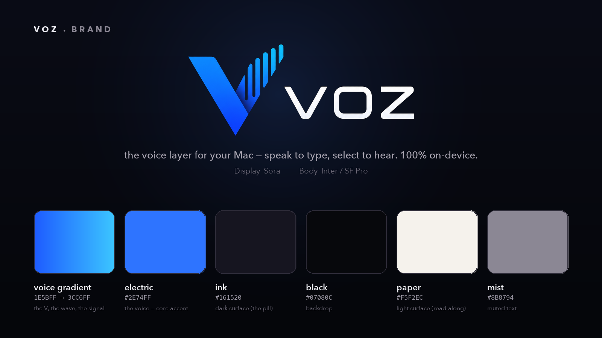

# voz — brand identity

A **fresh identity**, deliberately unrelated to the two parents (leelo's coral-on-cream,
dictado's dusk-blue-on-black). voz is the voice layer for your Mac, so the system is built
around two colors: **electric blue on black.** Blue is the voice — shiny, electric, a tech
signal; black is the surface it lives on.

The mark is a **`V` that rises into a sound-wave** — the *V* of voz and the signal of a voice
in one stroke. It runs on a **deep-royal → cyan gradient** (the foot of the V is electric blue;
the wave crests in cyan), set beside a wide, geometric **VOZ** wordmark.

## Wordmark

`voz` — **lowercase in prose.** Spanish for *voice*; one word for both directions (you speak to
it, it speaks to you). The logotype sets it as an uppercase geometric wordmark (**VOZ**) locked
to the V-wave monogram; in running text and copy it's always lowercase **voz**. Pairs the family
it descends from: *léelo* (read it), *dictado* (dictation), *narrado* (narrated), *jugada* (a play).

## Palette

| Token | Hex | Role |
| --- | --- | --- |
| **electric-deep** | `#1E5BFF` | Gradient base — the foot of the V (deep royal blue) |
| **electric** | `#2E74FF` | The voice — core electric blue: the wordmark chrome, controls, the live waveform, the read-along marker, the spinner + loading bar. The single in-app accent |
| **electric-bright** | `#3CC6FF` | Gradient crest — the cyan tip of the sound-wave |
| **voice gradient** | `#1E5BFF → #3CC6FF` | The mark's signature: the V rising into the wave. Identity surfaces only — logo, icon, hero, marketing |
| **ink** | `#161520` | Black surface (the dictation pill, dark UI) |
| **black** | `#07080C` | Backdrop — the deepest black behind the mark |
| **paper** | `#F5F2EC` | Light surface (the read-along panel) |
| **mist** | `#8B8794` | Muted text, secondary labels |
| **line-dark** | `#2A2833` | Hairline borders on dark surfaces |
| **line-light** | `#E5E0D6` | Hairline borders on light surfaces |

### Semantics (one accent: black + blue)

- The **voice gradient** (deep → cyan) is the identity signature — it lives on the logo, the
  app icon, and marketing surfaces, where the V *is* the wave.
- Inside the app, a single **solid electric** (`#2E74FF`, the gradient's mid-tone) carries
  everything — identity *and* activity. It's voz wherever an accent appears: brand chrome,
  controls, and the live signal.
- "Is it listening?" stays unambiguous through **motion**, not a second hue: the waveform only
  reacts to your voice while the mic is hot, and the spinner only spins while processing — the
  single most important honesty in a voice tool.

## Typography

- **Display / wordmark — Sora.** A geometric techno sans (circular *O*, even monoline, generous
  tracking) that echoes the VOZ logotype. Used for the wordmark and large marketing display.
- **Body / web & docs — Inter.** Clean, technical, neutral; the natural reading face under Sora.
- **Native app — SF Pro (system).** voz is a menu-bar utility, not a marketing surface, so the
  app UI uses the system font. Weights: `.heavy` for the read-along marker, `.bold` for controls,
  `.medium`/`.regular` for status and body.

## Voice & tone

Calm, plain, honest about privacy. Lowercase, unhurried. Never "AI-powered"; always
"on-device." The product brags about what *doesn't* happen (no cloud, no accounts, no saved
audio) as much as what does.

## Tagline

> the voice layer for your Mac — speak to type, select to hear. 100% on-device.
